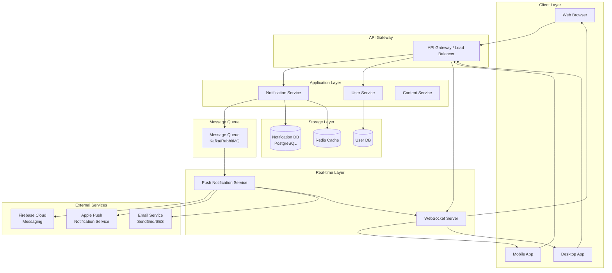
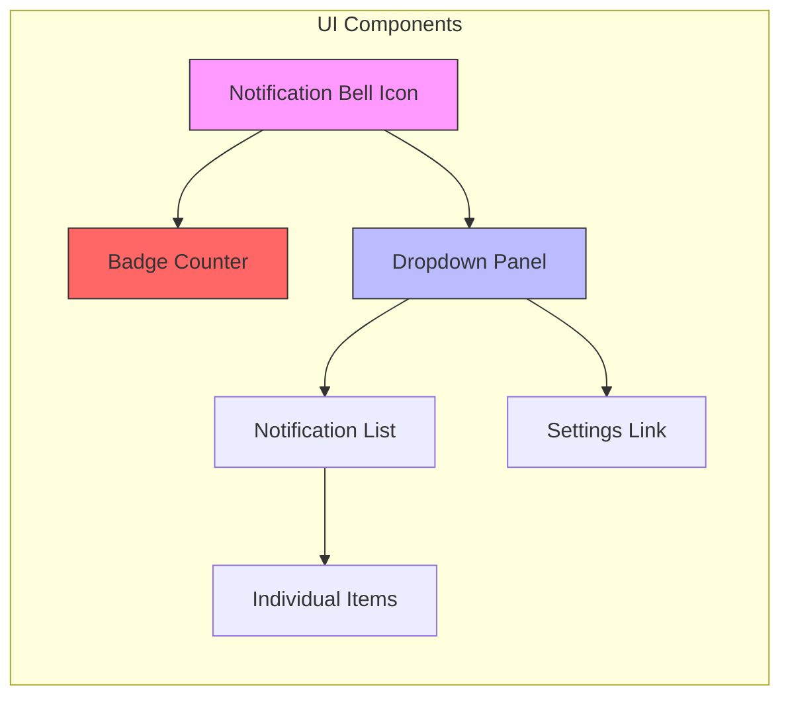
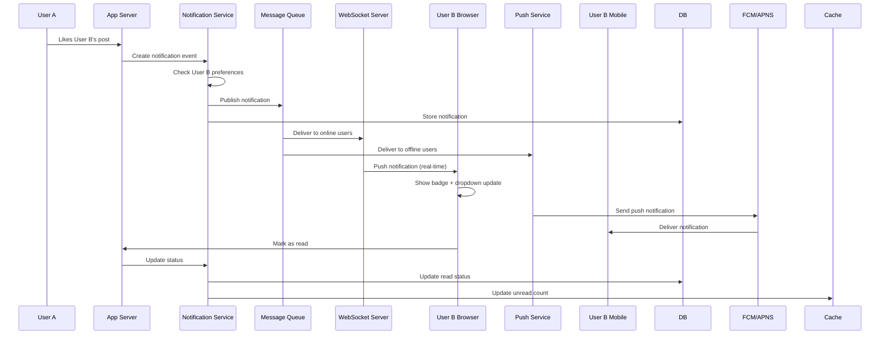
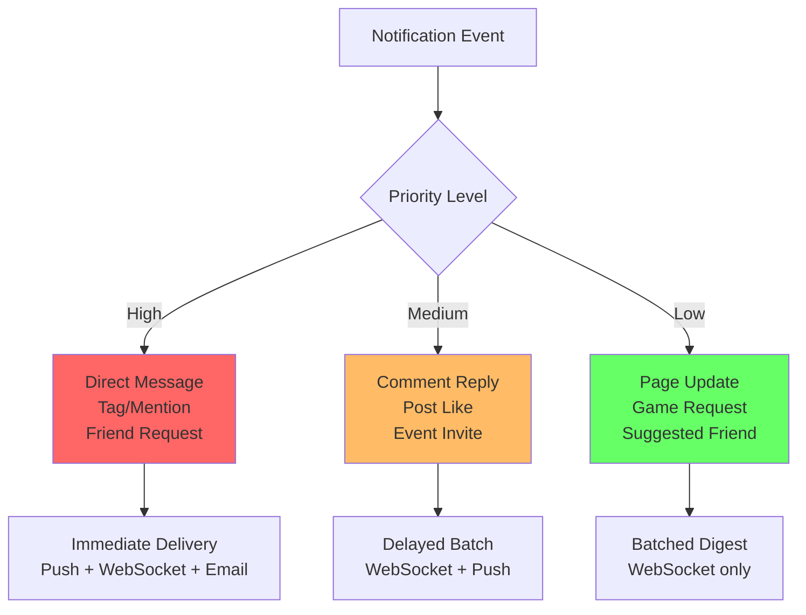
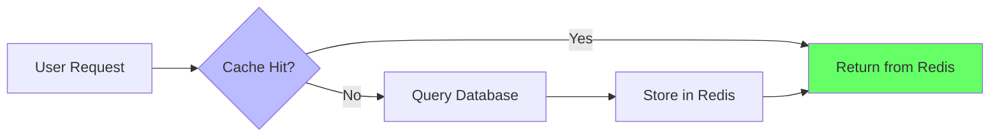
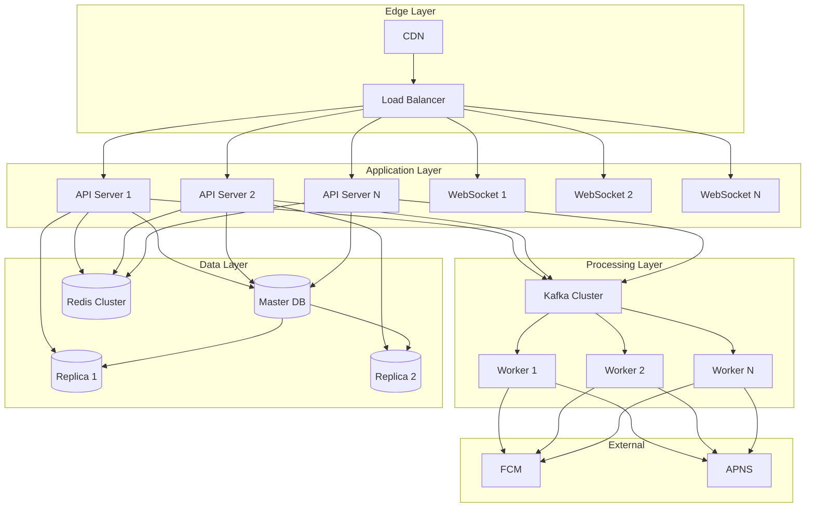

# Notification System - System Design Guide

## Table of Contents
1. [Overview](#overview)
2. [High-Level Architecture](#high-level-architecture)
3. [Core Components](#core-components)
4. [UI/UX Design Patterns](#uiux-design-patterns)
5. [System Design Deep Dive](#system-design-deep-dive)
6. [Scalability Considerations](#scalability-considerations)
7. [ Tips](#tips)

---

## Overview

A notification system like Facebook needs to handle:
- **Real-time delivery** of notifications to millions of users
- **Multiple notification types** (likes, comments, tags, messages, etc.)
- **Multiple delivery channels** (web, mobile, email, SMS)
- **User preferences** and notification settings
- **High availability** and low latency

---

## High-Level Architecture



---

## Core Components

### 1. **Notification Service**
The central service that handles notification creation, storage, and orchestration.

**Responsibilities:**
- Create notifications when events occur
- Store notification data
- Manage notification state (read/unread)
- Apply user preferences and filters
- Batch notifications when appropriate

### 2. **Message Queue (Kafka/RabbitMQ)**
Decouples notification generation from delivery.

**Why it's needed:**
- Handles traffic spikes (millions of likes during peak hours)
- Ensures reliability (retry failed deliveries)
- Enables asynchronous processing
- Supports multiple consumers

### 3. **WebSocket Server**
Maintains persistent connections for real-time updates.

**Key features:**
- Long-lived TCP connections
- Bi-directional communication
- Push updates instantly to clients
- Connection pooling and management

### 4. **Push Notification Service**
Handles mobile push notifications.

**Integrations:**
- Firebase Cloud Messaging (Android)
- Apple Push Notification Service (iOS)
- Device token management
- Delivery confirmation tracking

### 5. **Storage Layer**

**Notification Database:**
- Stores notification content and metadata
- Tracks read/unread status
- Maintains notification history
- Optimized for recent queries

**Cache (Redis):**
- Unread notification count
- Recent notifications (last 50)
- User online status
- User preferences

---

## UI/UX Design Patterns



### UI Components Breakdown

#### 1. **Notification Bell Icon**
- Always visible in header/navigation
- Indicates presence of notifications
- Clickable to open dropdown

#### 2. **Badge Counter**
- Shows unread count (e.g., "5")
- Red bubble for visual prominence
- Updates in real-time
- Disappears when count reaches 0

#### 3. **Dropdown Panel**
- Opens on bell click
- Fixed width (300-400px)
- Max height with scroll
- Positioned absolutely

**Panel Sections:**
- Header: "Notifications" title + settings icon
- Tabs: "All" | "Unread" | "Mentions"
- List: Scrollable notification items
- Footer: "See All" link

#### 4. **Individual Notification Item**

**Structure:**
- **Avatar:** User profile picture (40x40px)
- **Content:** 
  - Actor name (bold)
  - Action description
  - Target (post/comment)
- **Timestamp:** "2h ago" | "Yesterday" | "March 15"
- **Visual State:**
  - Blue dot/background for unread
  - Gray for read
- **Thumbnail:** Small preview image if relevant
- **Actions:** Sometimes includes quick action buttons

#### 5. **Notification Settings**
- Toggle notifications on/off
- Choose notification types
- Email preferences
- Sound settings
- Do Not Disturb schedule

---

## System Design Deep Dive

### Data Flow Diagram



### Notification Types and Priorities



---

## Scalability Considerations

### 1. **Horizontal Scaling**

**Application Servers:**
- Stateless services
- Load balancer distribution
- Auto-scaling based on traffic

**WebSocket Servers:**
- Connection pooling across servers
- Sticky sessions or shared state
- Redis pub/sub for cross-server communication

### 2. **Database Optimization**

**Partitioning Strategy:**
- Partition by user_id (hash-based)
- Each user's notifications in same partition
- Enables parallel queries

**Indexing:**
- Index on (user_id, created_at, read_status)
- Index on (user_id, read_status) for unread count
- Composite indexes for filtered queries

**Data Retention:**
- Keep last 30 days in hot storage
- Archive older notifications to cold storage
- Delete after 1 year (or user preference)

### 3. **Caching Strategy**



**What to Cache:**
- Unread notification count (TTL: 5 min)
- Recent 50 notifications per user (TTL: 10 min)
- User preferences (TTL: 1 hour)
- User online status (TTL: 30 sec)

### 4. **Message Queue Optimization**

**Topic-Based Routing:**
- Separate topics for different notification types
- Priority queues for urgent notifications
- Dead letter queue for failed deliveries

**Consumer Groups:**
- Multiple consumers for parallel processing
- Partition assignments for load distribution
- Auto-scaling consumers based on lag

### 5. **Rate Limiting**

**Prevent Notification Spam:**
- Max 100 notifications per user per hour
- Batch similar notifications (e.g., "John and 5 others liked your post")
- Aggregate low-priority notifications
- User-level quotas per notification type

---

## Database Schema Design

### Key Tables

#### notifications
```
- id (bigint, primary key)
- user_id (bigint, indexed) -- recipient
- actor_id (bigint) -- person who triggered
- type (enum) -- like, comment, mention, etc.
- entity_type (string) -- post, comment, photo
- entity_id (bigint) -- reference to post/comment
- content (jsonb) -- flexible content structure
- read_status (boolean, indexed)
- created_at (timestamp, indexed)
- read_at (timestamp)
```

#### notification_preferences
```
- user_id (bigint, primary key)
- notification_type (enum)
- channel (enum) -- push, email, sms
- enabled (boolean)
- updated_at (timestamp)
```

#### device_tokens
```
- id (bigint, primary key)
- user_id (bigint, indexed)
- device_type (enum) -- ios, android
- token (string)
- active (boolean)
- created_at (timestamp)
```

---

## Technology Stack Recommendations

### Backend
- **API Server:** Node.js, Go, Java Spring Boot
- **WebSocket:** Socket.io, Go Gorilla WebSocket
- **Message Queue:** Apache Kafka, RabbitMQ, AWS SQS
- **Cache:** Redis, Memcached

### Database
- **Primary DB:** PostgreSQL, MySQL
- **Time-series:** Cassandra, ScyllaDB (for high-volume logging)
- **Document Store:** MongoDB (for flexible notification content)

### Infrastructure
- **Load Balancer:** Nginx, AWS ALB
- **Container Orchestration:** Kubernetes, AWS ECS
- **Monitoring:** Prometheus, Grafana, DataDog
- **CDN:** CloudFlare, AWS CloudFront

### Push Notifications
- **Mobile:** Firebase Cloud Messaging, OneSignal
- **Web:** Web Push API, Service Workers
- **Email:** SendGrid, AWS SES

---

## Advanced Features

### 1. **Smart Batching**
Instead of: "John liked your post", "Mary liked your post", "Sam liked your post"

Show: "John, Mary, and Sam liked your post"

**Implementation:**
- Time window (e.g., 5 minutes)
- Group by notification type and entity
- Show aggregated notification

### 2. **Notification Ranking**
Prioritize notifications by:
- Recency
- Relationship strength (close friends first)
- Engagement likelihood
- User preferences

### 3. **Read Receipts**
Track when users see notifications:
- Mark as "delivered" when sent
- Mark as "seen" when panel opened
- Mark as "read" when clicked

### 4. **Notification Digests**
For low-priority notifications:
- Batch into hourly/daily digests
- Send via email
- Reduce notification fatigue

---

## Performance Metrics

### Key Metrics to Monitor

**Latency:**
- P50, P95, P99 delivery time
- Target: <100ms for real-time delivery
- Target: <1s for push notifications

**Throughput:**
- Notifications per second
- Peak traffic handling
- Target: 100K+ notifications/sec

**Availability:**
- Uptime percentage
- Target: 99.95%+

**Delivery Rate:**
- Successfully delivered notifications
- Target: >99%

**User Engagement:**
- Click-through rate
- Time to read
- Notification settings changes

---

## Tips

### Questions You Should Be Ready to Answer

1. **How do you handle millions of concurrent connections?**
   - WebSocket server clustering
   - Load balancing strategies
   - Connection management

2. **How do you prevent notification spam?**
   - Rate limiting
   - Smart batching
   - User preferences
   - Intelligent filtering

3. **What happens if a user is offline?**
   - Queue notifications
   - Push via mobile
   - Sync when online
   - Badge count updates

4. **How do you scale the system?**
   - Horizontal scaling
   - Database sharding
   - Caching strategies
   - Message queue partitioning

5. **How do you ensure reliability?**
   - Retry mechanisms
   - Dead letter queues
   - Idempotency
   - Circuit breakers

6. **How do you handle different notification types?**
   - Priority queues
   - Separate processing pipelines
   - User preference filtering
   - Template system

7. **How do you optimize database queries?**
   - Indexing strategies
   - Pagination
   - Caching
   - Partitioning

### Discussion Points

**Tradeoffs:**
- **Consistency vs Availability:** Eventually consistent for better availability
- **Real-time vs Batched:** Balance based on notification priority
- **Storage vs Performance:** Cache hot data, archive cold data

**Failure Scenarios:**
- WebSocket server crash → Reconnect with exponential backoff
- Database failure → Serve from cache, queue writes
- Message queue lag → Add more consumers, scale horizontally

**Future Enhancements:**
- Machine learning for personalization
- A/B testing for notification content
- Advanced analytics dashboard
- Cross-platform synchronization

---

## System Architecture Summary



---

## Conclusion

Building a Facebook-like notification system requires careful consideration of:
- **Real-time delivery** through WebSockets
- **Scalability** through message queues and horizontal scaling
- **Reliability** through redundancy and fault tolerance
- **User experience** through smart batching and prioritization
- **Performance** through caching and database optimization

The key is to start simple and add complexity as needed based on scale and requirements. In interviews, demonstrate understanding of tradeoffs and ability to design for scale.

**Remember:** There's no single "correct" design. The best design depends on:
- User base size
- Traffic patterns
- Budget constraints
- Team expertise
- Specific requirements

Good luck with your preparation!